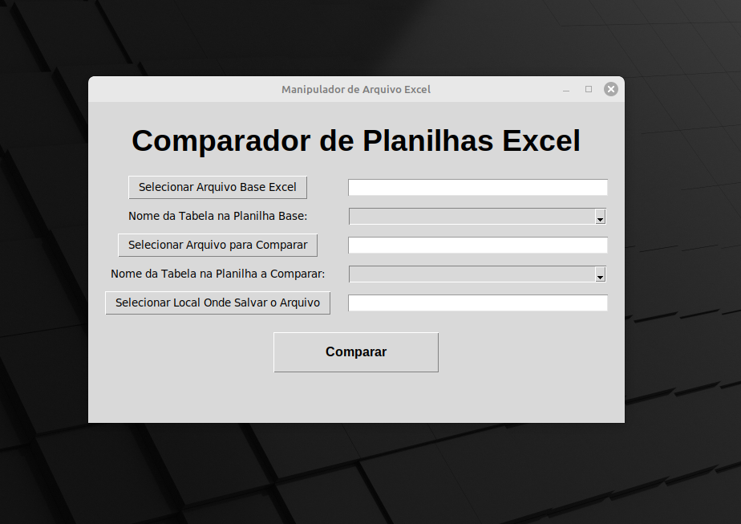

# Comparador de Arquivos Excel

Este é um programa simples que permite comparar dois arquivos Excel e identificar suas diferenças.

## Recursos:

- **Comparação Rápida:** Compare dois arquivos Excel de forma rápida e eficiente.
- **Destaque de Diferenças:** As diferenças são destacadas para facilitar a identificação.
- **Fácil de Usar:** Interface intuitiva para uma experiência de usuário sem complicações.

## Aplicação:

- **Arquivo Executável:** Na pasta Dist encontra-se o arquivo pronto para executar.

## Ferramentas:

- **tkinter:** Uma biblioteca gráfica em Python para criar interfaces de usuário (GUI).
- **filedialog e messagebox do tkinter:** Módulos que fornecem diálogos para seleção de arquivos e exibição de mensagens, respectivamente.
- **openpyxl:** Uma biblioteca Python para ler e escrever arquivos Excel (xlsx).
- **load_workbook e Workbook do openpyxl:** Funções para carregar e criar arquivos Excel, respectivamente.
- **PatternFill do openpyxl.styles:** Uma classe para definir preenchimentos de células com padrões em arquivos Excel.

## Instruções para gerar executavel

- **pyinstaller -F -i "icone.ico" nomeDoArquivo.py**

